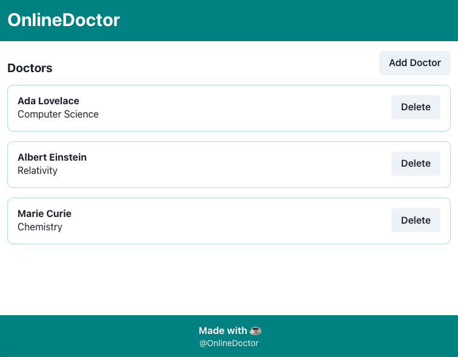
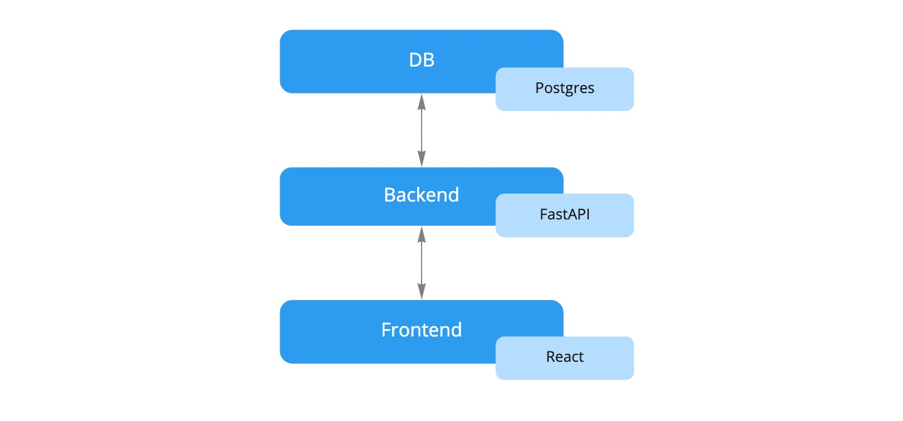

# OnlineDoctor Interview Session


## About this application

This is a very basic demo application for managing doctors. The purpose
of this demo is to have a simple enough starting point for our coding
interviews while still showcasing a tech stack that is close to what
we use in our actual applications. 



## Architecture

This application consists of a typical three tier setup with a
database, backend and frontend. Those pieces are orchestrated
using docker compose and configured in `docker-compose.yml`.



### Database
The postgres database has a single table for storing doctor information. 

### Backend
The backend is written in python using the FastAPI framework. It connects
to the database using the SQLAlchemy ORM.

### Frontend
The frontend is written in TypeScript using React. It is built using the
parcel bundler.


## Running the application
To run the application execute the following command in this directory.

```
docker-compose up
```

This will start database, backend and frontend in development mode. The source
code is mounted into the running containers. That also means the applications will
automatically rebuild when code changes.